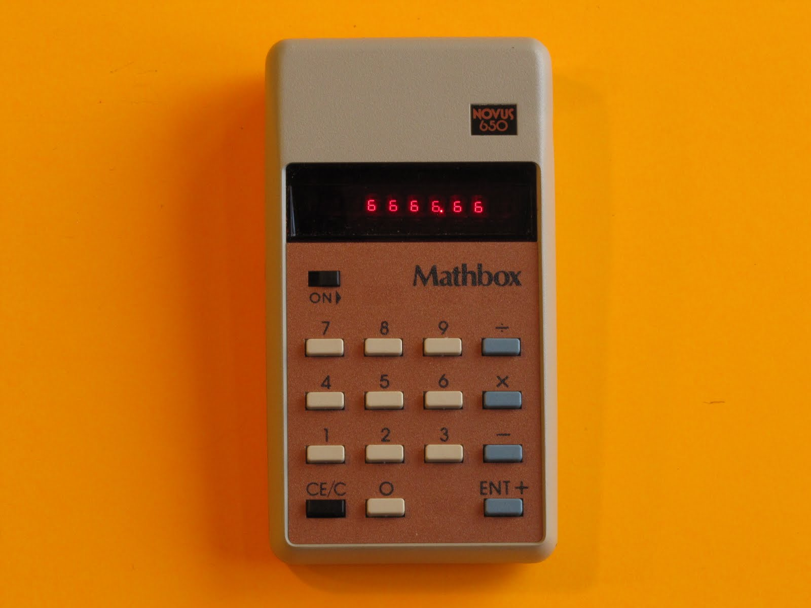

# Javascript Calculator Project

Create a working calculator based on a picture that you will be reproducing using HTML + SCSS.

### The design i chose:                     
                                            
         
                                            

### My recreation:

## Part 1

### MVP

1. Create a calculator to be rendered to the html page
1. it should have number keys from 0 to 9
1. It should have operator keys (+, -, /, \*, =)
1. It should have a display rendering the current calculation in a box at the top
1. It should also have a “.” key

## Part 2

### MVP

1. Should render the current calculation in a box at the top (calculator display)
1. It should handle decimals
1. It doesn’t need to support orders of operation
1. It should not use eval() or Function() constructor
1. Make sure to keep your pure functions separated from the JS DOM interaction code.
